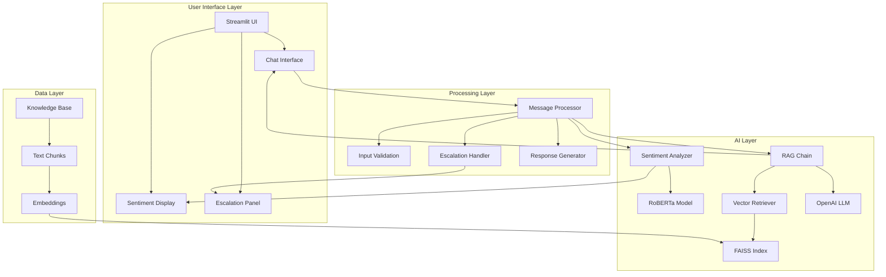
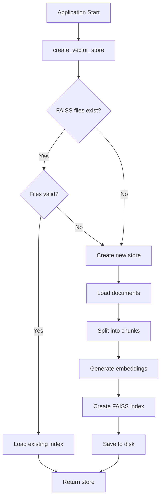
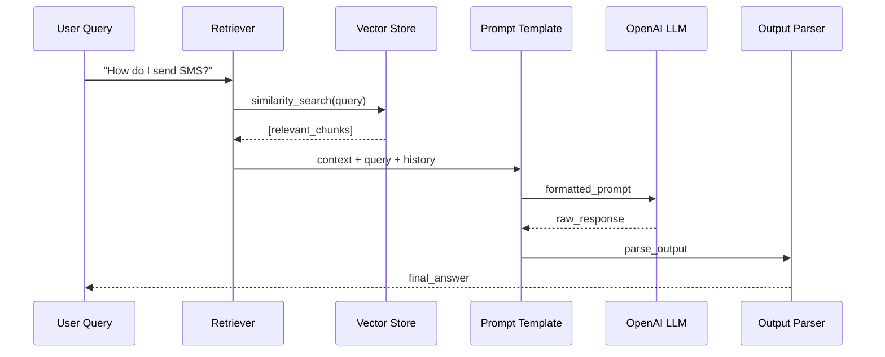
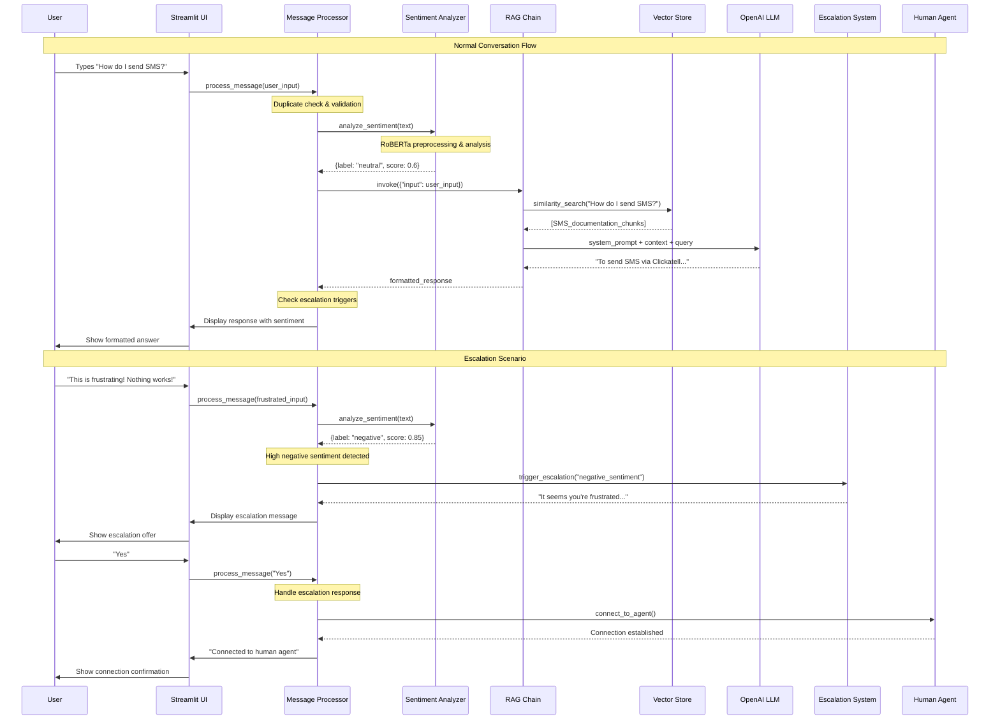
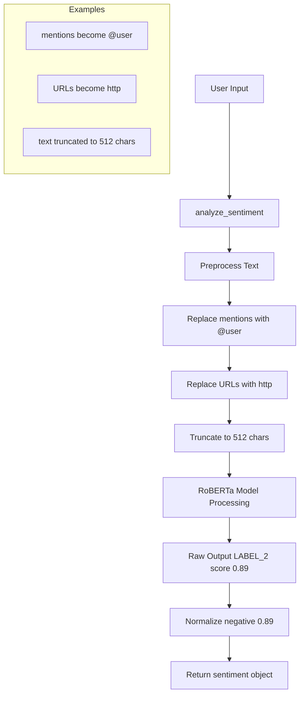

# Clickatell AI Assistant - Complete Developer Guide

## Table of Contents
1. [Overview](#overview)
2. [Architecture](#architecture)
3. [Setup & Installation](#setup--installation)
4. [Core Components](#core-components)
5. [Data Flow](#data-flow)
6. [Code Structure](#code-structure)
7. [Key Functions](#key-functions)
8. [UI Components](#ui-components)
9. [Configuration](#configuration)
10. [Troubleshooting](#troubleshooting)
11. [Development Workflow](#development-workflow)

## Overview

The Clickatell AI Assistant is a single-file Streamlit application that combines multiple AI technologies to create an intelligent customer service chatbot. It uses:

- **RAG (Retrieval-Augmented Generation)**: Combines knowledge base search with LLM generation
- **Sentiment Analysis**: Real-time emotion detection using RoBERTa
- **Human Escalation**: Automatic handoff to human agents when needed
- **Vector Search**: FAISS for fast similarity search in knowledge base

### Key Features
- ✅ Real-time chat interface with message history
- ✅ Sentiment-aware responses with visual feedback
- ✅ Automatic escalation based on sentiment and AI confidence
- ✅ Knowledge base integration with vector search
- ✅ Clean white theme with gradient components
- ✅ Session persistence and error handling

## Architecture



## Setup & Installation

### Prerequisites
```bash
# Required Python packages
pip install streamlit
pip install langchain
pip install langchain-community
pip install langchain-openai
pip install langchain-huggingface
pip install faiss-cpu
pip install transformers
pip install python-dotenv
```

### Environment Setup
Create `.env` file in project root:
```env
OPENAI_API_KEY=your_openai_api_key_here
```

### File Structure
```
project_root/
├── clickatell_chatbot_single.py    # Main application
├── .env                            # Environment variables
├── .streamlit/
│   └── config.toml                 # Streamlit theme config
├── data/
│   └── knowledge_base_clickatell.txt  # Knowledge base
├── components/ui/assets/
│   └── logo.png                    # Optional logo
└── vector_store/faiss_index/       # Auto-generated FAISS files
    ├── index.faiss
    └── index.pkl
```

## Core Components

### 1. Configuration System
**Location**: Lines 47-60

```python
# File paths for knowledge base and vector storage
KNOWLEDGE_FILE = os.path.join("data", "knowledge_base_clickatell.txt")
VECTOR_STORE_PATH = os.path.join("vector_store", "faiss_index")

# AI model configurations
EMBEDDING_MODEL = "sentence-transformers/all-MiniLM-L6-v2"  # Text embeddings
CHAT_MODEL = "gpt-3.5-turbo"                               # OpenAI chat model

# Processing parameters
CHUNK_SIZE = 600      # Characters per knowledge chunk
CHUNK_OVERLAP = 80    # Overlap for context preservation
SEARCH_RESULTS = 5    # Number of relevant chunks to retrieve
```

**Purpose**: Centralized configuration makes it easy to modify models, file paths, and processing parameters without hunting through code.

### 2. Vector Store Management
**Location**: Lines 350-420



**Key Code Sections**:
```python
def create_vector_store():
    embeddings = initialize_embeddings()
    
    # Smart loading: try existing first
    if files_exist and files_valid:
        store = FAISS.load_local(VECTOR_STORE_PATH, embeddings, 
                                allow_dangerous_deserialization=True)
        return store
    
    # Create new: load → split → embed → save
    loader = TextLoader(KNOWLEDGE_FILE, encoding="utf-8")
    documents = loader.load()
    
    splitter = RecursiveCharacterTextSplitter(
        chunk_size=CHUNK_SIZE, 
        chunk_overlap=CHUNK_OVERLAP
    )
    chunks = splitter.split_documents(documents)
    
    store = FAISS.from_documents(chunks, embeddings)
    store.save_local(VECTOR_STORE_PATH)
    return store
```

**Why This Matters**: Vector stores are expensive to create but fast to load. This system automatically rebuilds when needed but reuses existing indexes for performance.

### 3. RAG Chain Architecture
**Location**: Lines 450-520



**Chain Components**:
```python
chain = (
    {
        "input": lambda x: x["input"],                    # User query
        "chat_history": lambda x: x["chat_history"],     # Conversation context
        "context": lambda x: format_documents(           # Retrieved knowledge
            retriever.invoke(x["input"])
        )
    }
    | prompt          # System prompt + context + query
    | llm            # OpenAI generation
    | StrOutputParser()  # Clean text output
)
```

**System Prompt Structure**:
```python
prompt = ChatPromptTemplate.from_messages([
    MessagesPlaceholder(variable_name="chat_history"),  # Previous messages
    ("system", """
    You are Clickatell's AI Assistant...
    
    **Response Guidelines:**
    • Use ONLY information from the provided context
    • Use bullet points for lists
    • Use numbered steps for procedures
    • Include contact information when relevant
    
    ### Knowledge Base Context:
    {context}
    """),
    ("human", "{input}")  # Current user query
])
```

## Data Flow

### Complete Message Processing Flow



### Sentiment Analysis Pipeline



**Code Implementation**:
```python
def analyze_sentiment(text, session_id=None):
    # Social media text preprocessing
    preprocessed = " ".join(
        '@user' if w.startswith('@') else    # Normalize mentions
        'http' if w.startswith('http') else  # Normalize URLs  
        w                                     # Keep other words
        for w in text.split()
    )
    
    # RoBERTa analysis (max 512 chars)
    result = st.session_state.sentiment_analyzer(preprocessed[:512])[0]
    
    return {
        "label": result["label"].lower(),  # negative/positive/neutral
        "score": float(result["score"])   # confidence 0.0-1.0
    }
```

## Key Functions

### 1. Message Processing (`process_message()`)
**Location**: Lines 650-750

This is the heart of the application. Every user message flows through this function.

```python
def process_message(user_input):
    # 1. VALIDATION: Prevent duplicate/concurrent processing
    if st.session_state.get('processing', False):
        return
    
    # 2. ESCALATION HANDLING: Check if awaiting Yes/No response
    if st.session_state.get('awaiting_human_response', False):
        if user_input.lower().strip() in ['yes', 'y', 'yeah']:
            connect_to_agent()  # Show connection animation
            return
        elif user_input.lower().strip() in ['no', 'n', 'nope']:
            # Continue with AI assistance
            return
    
    # 3. SENTIMENT ANALYSIS: Analyze user emotion
    sentiment = analyze_sentiment(user_input)
    st.session_state.last_sentiment = sentiment  # Store for UI
    
    # 4. AI RESPONSE GENERATION: Use RAG chain
    try:
        response = st.session_state.qa_chain.invoke({
            "input": user_input
        }, config={"configurable": {"session_id": session_id}})
    except Exception:
        response = "I'm having trouble processing your request."
        escalation_reason = "ai_confidence_low"
    
    # 5. ESCALATION DETECTION: Check triggers
    if sentiment["label"] == "negative" and sentiment["score"] > 0.7:
        escalation_reason = "negative_sentiment"
    elif "I don't have that specific information" in response:
        escalation_reason = "ai_confidence_low"
    
    # 6. RESPONSE HANDLING: Normal or escalation
    if escalation_reason:
        response = trigger_escalation(escalation_reason)
        st.session_state.awaiting_human_response = True
    
    # 7. MESSAGE STORAGE: Add to conversation history
    st.session_state.messages.append({
        "role": "assistant",
        "content": response,
        "timestamp": datetime.now().strftime("%I:%M %p"),
        "is_escalation": bool(escalation_reason)
    })
```

### 2. Vector Store Creation (`create_vector_store()`)
**Location**: Lines 350-420

Handles the complex process of creating or loading the knowledge base index.

**Smart Loading Logic**:
```python
# Check file existence and validity
files_exist = os.path.exists(index_file) and os.path.exists(pkl_file)
files_valid = (os.path.getsize(index_file) > 0 and 
               os.path.getsize(pkl_file) > 0)

if files_exist and files_valid:
    # Load existing (fast)
    store = FAISS.load_local(VECTOR_STORE_PATH, embeddings)
else:
    # Create new (slow but necessary)
    documents = TextLoader(KNOWLEDGE_FILE).load()
    chunks = splitter.split_documents(documents)
    store = FAISS.from_documents(chunks, embeddings)
    store.save_local(VECTOR_STORE_PATH)
```

### 3. Chat Chain Creation (`create_chat_chain()`)
**Location**: Lines 450-520

Builds the RAG pipeline that combines retrieval with generation.

**Chain Architecture**:
```python
# Input processing: extract components from user input
{
    "input": lambda x: x["input"],           # Current question
    "chat_history": lambda x: x["chat_history"],  # Previous messages
    "context": lambda x: format_documents(   # Retrieved knowledge
        retriever.invoke(x["input"])
    )
}
# Pipeline: input → prompt → LLM → parser → output
| prompt | llm | StrOutputParser()
```

## UI Components

### 1. Chat Interface (`render_chat_messages()`)
**Location**: Lines 580-620

Renders the conversation with custom styling for different message types.

```python
def render_chat_messages(messages):
    for message in messages:
        role = message.get("role")
        is_escalation = message.get("is_escalation", False)
        
        if role == "user":
            # User messages: right-aligned, blue gradient
            st.markdown(f'<div class="user-message">{content}</div>')
        else:
            # Bot messages: left-aligned, white background
            # Escalation messages: red gradient background
            message_class = "escalation-message" if is_escalation else "bot-message"
            icon = "⚠️" if is_escalation else "🤖"
            st.markdown(f'<div class="{message_class}">{icon} {content}</div>')
```

### 2. Sentiment Display
**Location**: Lines 800-850

Real-time sentiment visualization in the sidebar.

```python
# Color coding based on sentiment
if sentiment["label"] == "positive":
    color = "#22c55e"  # Green
    bg_color = "linear-gradient(135deg, #f0fdf4 0%, #dcfce7 100%)"
elif sentiment["label"] == "negative":
    color = "#ef4444"  # Red  
    bg_color = "linear-gradient(135deg, #fef2f2 0%, #fecaca 100%)"
else:
    color = "#6b7280"  # Gray
    bg_color = "linear-gradient(135deg, #f9fafb 0%, #f3f4f6 100%)"

# Display with emoji and confidence score
st.markdown(f"""
<div class="sentiment-card" style="background: {bg_color};">
    <div class="sentiment-emoji">{emoji}</div>
    <h4 style="color: {color};">{label}</h4>
    <p>Confidence: {score}</p>
</div>
""")
```

### 3. Escalation System
**Location**: Lines 600-650

Handles the transition from AI to human agents.

**Escalation Triggers**:
1. **High Negative Sentiment**: `score > 0.7` and `label == "negative"`
2. **AI Knowledge Gap**: Response contains "I don't have that specific information"
3. **Processing Errors**: Exception during AI response generation

**Escalation Messages**:
```python
def trigger_escalation(reason, session_id):
    if reason == "negative_sentiment":
        return "⚠️ It seems you're frustrated. Would you like to be connected to a human? (Yes/No)"
    elif reason == "ai_confidence_low":
        return "🤔 I don't have information about that. Would you like me to connect you to a human agent? (Yes/No)"
    else:
        return "Would you like me to connect you to a human agent? (Yes/No)"
```

## Configuration

### 1. Streamlit Theme (`.streamlit/config.toml`)
```toml
[theme]
base = "light"                    # Light theme base
backgroundColor = "#ffffff"       # Pure white background
secondaryBackgroundColor = "#f0f2f6"  # Light gray for components
textColor = "#262730"            # Dark text for contrast
```

### 2. Model Configuration
```python
# Embedding model for text vectorization
EMBEDDING_MODEL = "sentence-transformers/all-MiniLM-L6-v2"
# - Fast and efficient
# - Good for general text similarity
# - 384-dimensional embeddings

# Chat model for response generation  
CHAT_MODEL = "gpt-3.5-turbo"
# - Cost-effective OpenAI model
# - Good balance of quality and speed
# - 4K context window

# Sentiment model (loaded automatically)
SENTIMENT_MODEL = "cardiffnlp/twitter-roberta-base-sentiment-latest"
# - Trained on social media text
# - Handles informal language well
# - Returns: LABEL_0 (negative), LABEL_1 (neutral), LABEL_2 (positive)
```

### 3. Processing Parameters
```python
CHUNK_SIZE = 600        # Characters per knowledge chunk
# - Small enough for focused retrieval
# - Large enough to maintain context
# - Balances precision vs. recall

CHUNK_OVERLAP = 80      # Overlap between chunks
# - Prevents information loss at boundaries
# - Maintains context across splits
# - ~13% overlap ratio

SEARCH_RESULTS = 5      # Retrieved chunks per query
# - Provides sufficient context
# - Avoids overwhelming the LLM
# - Balances relevance vs. noise
```

## Troubleshooting

### Common Issues & Solutions

| Issue | Symptoms | Cause | Solution |
|-------|----------|-------|----------|
| **Vector store not found** | "📁 No valid vector store found" | Missing FAISS files | Normal - app will create automatically |
| **OpenAI API error** | "Failed to initialize AI components" | Missing/invalid API key | Check `.env` file has `OPENAI_API_KEY=...` |
| **Sentiment not working** | Always shows neutral sentiment | `transformers` not installed | Run `pip install transformers` |
| **White theme not working** | Dark background visible | Missing theme config | Create `.streamlit/config.toml` with theme settings |
| **Knowledge base empty** | "❌ Knowledge base file is empty" | Missing/empty knowledge file | Check `data/knowledge_base_clickatell.txt` exists |
| **Memory errors** | App crashes during startup | Large knowledge base | Reduce `CHUNK_SIZE` or split knowledge file |

### Debug Mode
Add this to enable detailed logging:
```python
import logging
logging.basicConfig(level=logging.DEBUG)

# Add to any function for debugging
st.write(f"Debug: {variable_name}")
```

### Performance Monitoring
```python
import time

# Time expensive operations
start_time = time.time()
result = expensive_function()
st.write(f"Operation took {time.time() - start_time:.2f} seconds")
```

## Development Workflow

### 1. Adding New Knowledge
```bash
# 1. Edit knowledge base
nano data/knowledge_base_clickatell.txt

# 2. Delete vector store to force rebuild
rm -rf vector_store/

# 3. Restart application
streamlit run clickatell_chatbot_single.py
```

### 2. Modifying AI Behavior
```python
# Change system prompt (lines 470-490)
prompt = ChatPromptTemplate.from_messages([
    ("system", "Your new instructions here..."),
    ("human", "{input}")
])

# Adjust escalation sensitivity (lines 720-730)
if sentiment["score"] > 0.8:  # More sensitive (was 0.7)
    escalation_reason = "negative_sentiment"
```

### 3. UI Customization
```python
# Modify CSS in load_css() function (lines 65-300)
def load_css():
    return """
    <style>
    .user-message { 
        background: your-new-color;
    }
    </style>
    """
```

### 4. Adding New Features
```python
# 1. Add configuration constants
NEW_FEATURE_ENABLED = True

# 2. Modify process_message() to include new logic
def process_message(user_input):
    if NEW_FEATURE_ENABLED:
        # Your new feature logic
        pass

# 3. Update UI components if needed
def render_new_component():
    st.markdown("Your new UI component")
```

### 5. Testing Strategy
```python
# Test individual components
def test_sentiment_analysis():
    result = analyze_sentiment("I love this service!")
    assert result["label"] == "positive"
    assert result["score"] > 0.5

# Test escalation logic
def test_escalation():
    # Simulate high negative sentiment
    st.session_state.last_sentiment = {"label": "negative", "score": 0.8}
    # Process message and verify escalation triggered
```

### 6. Deployment Checklist
- [ ] `.env` file with valid OpenAI API key
- [ ] Knowledge base file exists and is populated
- [ ] All dependencies installed (`pip install -r requirements.txt`)
- [ ] Streamlit config file created
- [ ] Test basic conversation flow
- [ ] Test escalation scenarios
- [ ] Verify sentiment analysis working
- [ ] Check UI theme and styling

This comprehensive guide provides everything a junior developer needs to understand, modify, and extend the Clickatell AI Assistant application.