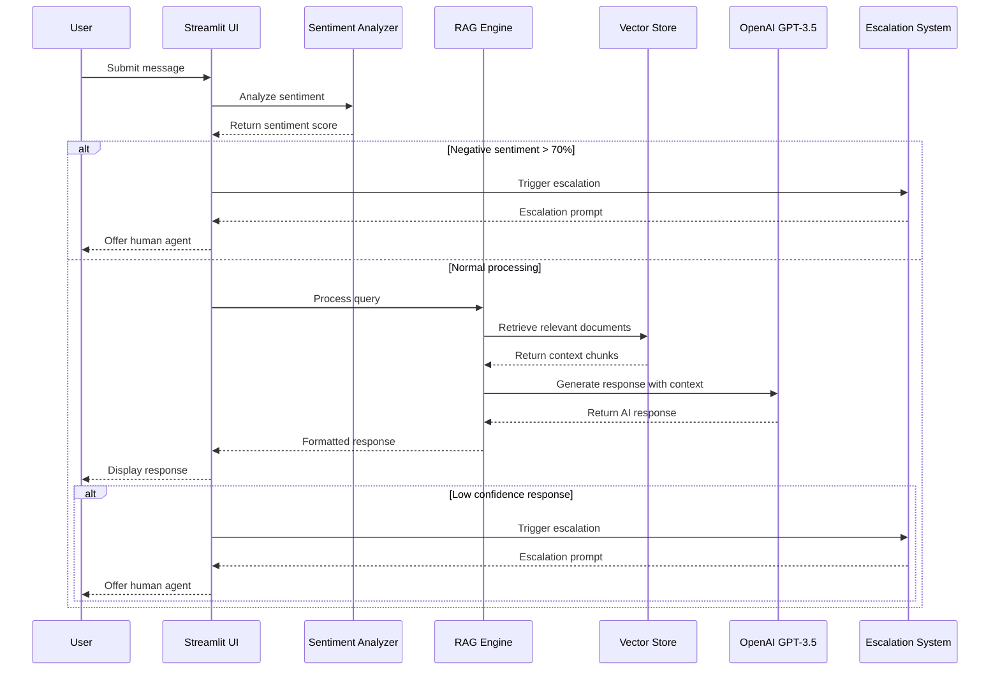
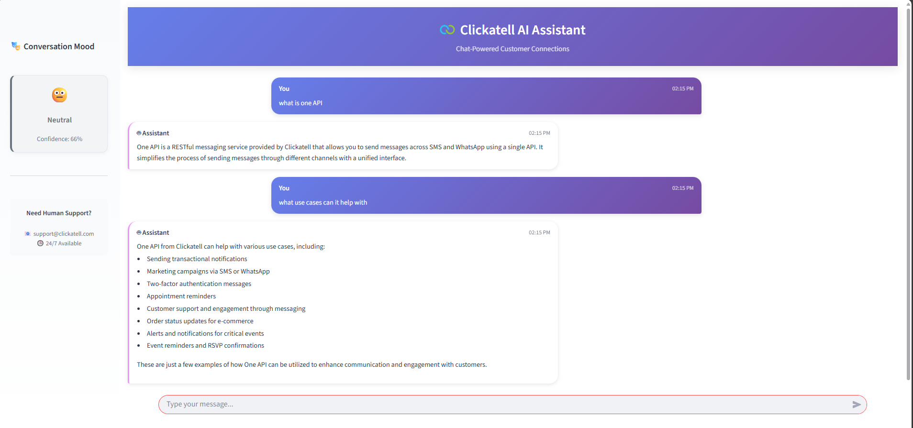
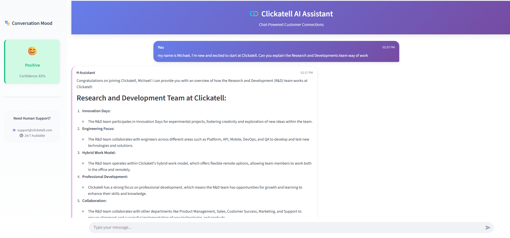
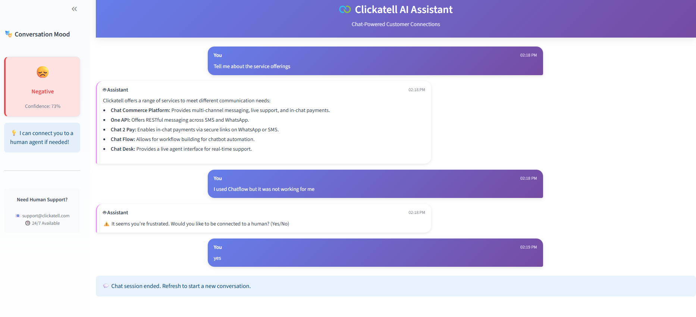

# RAG Augmented Chatbot with Sentiment analysis and Human in the loop escalation

## Architecture

### System Components

- **RAG Engine**: FAISS vector database with OpenAI GPT-3.5-turbo
- **Sentiment Analysis**: RoBERTa-based classification model
- **Document Processing**: Multi-format ingestion (TXT, MD, PDF, DOCX)
- **Session Management**: Persistent conversation state
- **Escalation System**: Automated human handoff triggers

### Sequence Diagram



## Installation

### Prerequisites

- Python 3.8 or higher
- OpenAI API key
- Git

### Setup

1. Clone repository:
```bash
git clone <repository-url>
cd grad_project
```

2. Install dependencies:
```bash
pip install -r requirements.txt
```

3. Configure environment variables in `.env`:
```env
OPENAI_API_KEY=your_api_key_here
```

4. Create knowledge base directory:
```bash
mkdir -p data/documents
```

5. Launch application:
```bash
streamlit run clickatell_chatbot_single.py
```

## Configuration

### Environment Variables

| Variable | Description | Required |
|----------|-------------|----------|
| `OPENAI_API_KEY` | OpenAI API authentication key | Yes |

### Model Configuration

The system uses the following models (configurable in [clickatell_chatbot_single.py](clickatell_chatbot_single.py)):

```python
EMBEDDING_MODEL = "sentence-transformers/all-MiniLM-L6-v2"
CHAT_MODEL = "gpt-3.5-turbo"
CHUNK_SIZE = 600
CHUNK_OVERLAP = 80
SEARCH_RESULTS = 5
```

### Sentiment Analysis Configuration

Sentiment thresholds in [analyze_sentiment()](clickatell_chatbot_single.py#L234):

```python
if sentiment["label"] == "negative" and sentiment["score"] > 0.7:
    escalation_reason = "negative_sentiment"
```

## Project Structure

```
grad_project/
├── clickatell_chatbot_single.py    # Main application
├── README.md                       # Documentation
├── requirements.txt               # Dependencies
├── .env                          # Environment configuration
├── data/
│   └── documents/               # Knowledge base files
├── vector_store/               # FAISS index storage
└── components/
    └── ui/
        └── assets/
            └── logo.png        # Application logo
```

## Core Functions

### Document Processing

The [load_documents_from_folder()](clickatell_chatbot_single.py#L156) function handles multi-format document ingestion:

```python
def load_documents_from_folder():
    """Load all supported documents from data/documents folder."""
    # Supports .txt, .md, .pdf, .docx formats
    # Returns list of Document objects with metadata
```

### Vector Store Management

The [create_vector_store()](clickatell_chatbot_single.py#L124) function manages FAISS index creation and loading:

```python
def create_vector_store():
    """Create or load FAISS vector store from documents folder."""
    # Handles index persistence and document chunking
    # Returns configured FAISS store
```

### Conversation Chain

The [create_chat_chain()](clickatell_chatbot_single.py#L186) function builds the RAG pipeline:

```python
def create_chat_chain(vector_store):
    """Create the conversational RAG chain"""
    # Combines retriever, prompt template, and LLM
    # Returns RunnableWithMessageHistory instance
```

### Sentiment Analysis

The [analyze_sentiment()](clickatell_chatbot_single.py#L234) function processes user input:

```python
def analyze_sentiment(text, session_id=None):
    """Analyze sentiment using RoBERTa model."""
    # Returns {"label": str, "score": float}
    # Handles preprocessing for social media text
```

### Escalation Logic

The [trigger_escalation()](clickatell_chatbot_single.py#L278) function manages human handoff:

```python
def trigger_escalation(reason, session_id):
    """Generate appropriate escalation message based on trigger reason."""
    # Handles different escalation scenarios
    # Returns formatted escalation prompt
```

## Dependencies

```txt
streamlit>=1.28.0
langchain>=0.1.0
langchain-community>=0.0.20
langchain-openai>=0.0.5
langchain-huggingface>=0.0.1
faiss-cpu>=1.7.4
transformers>=4.35.0
torch>=2.0.0
python-dotenv>=1.0.0
PyPDF2>=3.0.1
docx2txt>=0.8
```

## Usage

### Basic Operation

1. Start the application using `streamlit run clickatell_chatbot_single.py`
2. Access the interface at `http://localhost:8501`
3. Add knowledge base documents to `data/documents/`
4. Interact through the chat interface

### Knowledge Base Management

Supported document formats:
- Text files (.txt, .md)
- PDF documents (.pdf)
- Word documents (.docx)

Documents are automatically processed and indexed on application startup.

### Escalation Triggers

The system triggers escalation under these conditions:
- Negative sentiment with confidence > 70%
- AI response contains knowledge limitation indicators
- Processing errors occur

## Troubleshooting

### Common Issues

**API Key Error**
```
ValueError: OPENAI_API_KEY not found in environment variables
```
Solution: Verify `.env` file exists with valid API key

**Document Loading Error**
```
No documents found in data/documents folder
```
Solution: Create directory and add supported file formats

**Vector Store Error**
```
Failed to load vector store
```
Solution: Delete `vector_store/` directory to force rebuild

### Performance Optimization

- Limit document size for faster processing
- Adjust `CHUNK_SIZE` based on content complexity
- Monitor OpenAI API rate limits and usage

## Development

### Code Structure

The application follows a modular architecture:

- **Configuration**: Constants and environment setup
- **AI Components**: RAG pipeline and sentiment analysis
- **UI Components**: Streamlit interface elements
- **Main Application**: Orchestration and message processing

### Key Classes and Functions

- [initialize_embeddings()](clickatell_chatbot_single.py#L89): HuggingFace embedding model setup
- [initialize_sentiment_analyzer()](clickatell_chatbot_single.py#L104): RoBERTa sentiment model initialization
- [process_message()](clickatell_chatbot_single.py#L456): Main message processing pipeline
- [main()](clickatell_chatbot_single.py#L548): Application entry point

## User-Interface
#### *Image 1: Neutral sentiment*  

 &nbsp;&nbsp;&nbsp;

#### *Image 2: Positive sentiment*  

 &nbsp;
#### *Image 3: Negative sentiment*  


